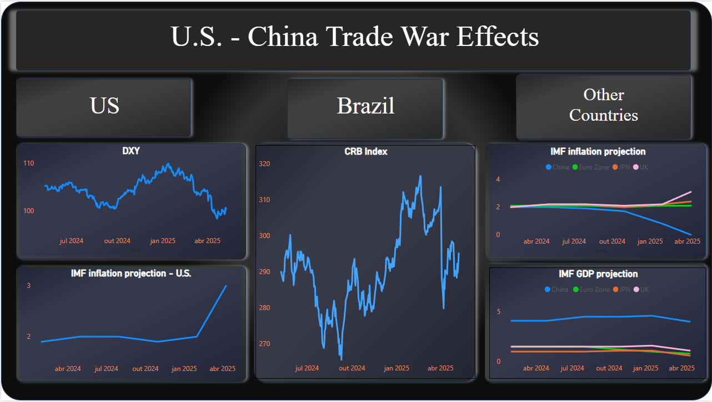
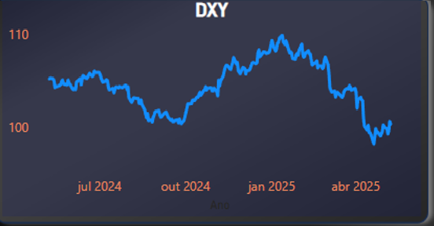
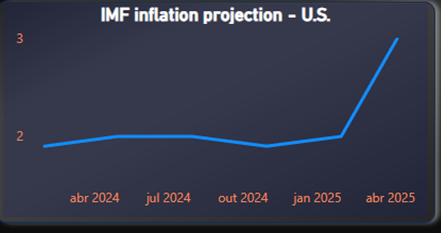
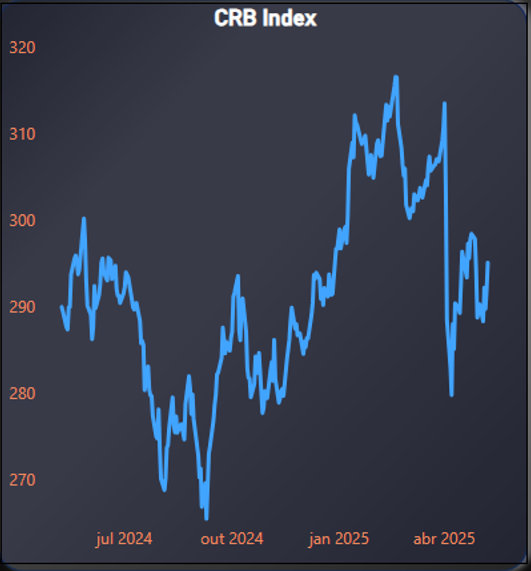
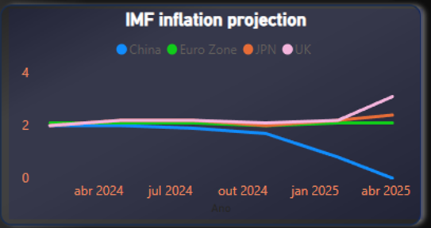
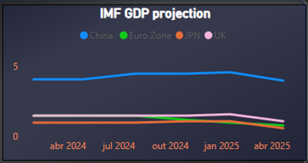

## Dashboard

## Introduction

On April 2nd, President Trump imposed reciprocal tariffs for U.S. trading partners. It was intended to address unfair trade tariffs and taxes that U.S. was facing from those countries, and it could fluctuate up to 50% if a specific country had a trade surplus with U.S. 

 Even countries without a trade surplus faced a baseline tariff of 10%. But, Canada, Mexico and China were excluded from this, such as specific products like steel, aluminum, autos, semiconductors and pharma.

 Many countries responded with some retaliatory tariffs. Regarding China, the initial tariff was 10% (February), increased to 20% (later in February), then to 50% (April) and finally 125% upon the initial 20%, resulting in 145%. On the other hand, China also increased its retaliation tariffs up to 125%.

 And this escalation led to a trade war environment between the 2 countries but with spillover effects to other countries.

 The analysis will be mainly focused on U.S., Brazil and other countries (China, Japan, UK and European Union countries). 

## United States

According to [Tax Foundation](https://taxfoundation.org/research/all/federal/trump-tariffs-trade-war/) calculations, before retaliation, the tariffs imposed by Trump would reduce U.S. GDP by 0.7%, and after retaliation, another 0.2, resulting in a 0.9 reduction. 

 As is well known, when a country faces very high taxation, it impacts domestic prices through the pass-through effect. Since industrial input costs will be higher, producers tend to pass some of these increases to the final consumer, leading to a spike in inflation. And after that, domestic consumption deteriotates, impacting the output negatively. 

The U.S. dollar appreciated after the 2024 elections due to market expectations of stronger U.S. economic growth. However, high tariffs, global uncertainty and a decline in market confidence, the U.S. dollar lost much of its strength. At the same time, the Euro began to gain value due to region-specific policies but also as a new short-term "safe haven". 

According to the IMF, U.S. inflation rose 1.0% compared to its own January projections. Not only by the short-term impacts of the pass-through effect, but also by upward pressures in the service sector.

  
## Brazil

The trade war creted a window of opportunity for Brazilian farmers, allowing them to gain market share from the U.S. and expand their oilseeds exports. Although 70% of China's soybeans imports already come from Brazil, the halt in American grains imports will give Brazil a chance to fill the gap and export more oilseeds commodities in replace. However, it may lead to inflationary pressures over the Brazilian commodities, and a pass-through on food prices. 

 Even with a truce between US and China, Brazil keeps exporting a high volume of soybeans to China. First because there’s no tariffs from the Asian country, and also due to the Brazilian agro technology that makes it cheaper to export. 

 CRB index as a whole may be falling due to the lower Chinese demand at the moment and a huge supply by the producers outside OPEC+. Another factor is the expectation that a trade war could reduce global demand, and it is particularly true for oil prices. A decline in commodity prices, especially oil and copper, may signal an approaching recession as it shows a slower industrial activity from China, the largest importer worldwide. On the other hand, agro commodity prices went up because of bad weather conditions.  

## Rest of the world

 In January, the overall outlook from IMF for inflation forecast was a convergence to target by the end of 2025. The labor market was starting to cool slightly (slower hiring and increasing layoffs) and therefore diminishing inflationary pressures. After the tariffs, the forecasts as a whole worsened.

 For UK, there was some changes in regulated prices. For the Euro Zone, no change. Surprisingly, China’s inflation is expected to decline. By now, it may be too soon to start analyzing the effects of tariffs on countries.

 In general terms, inflation forecasts are getting better but not as close to pre-pandemic levels, and with a lot of uncertainty around. 

 It can be said that theses consequences may vary across countries, mainly because it will depend  on the extent of the tariffs imposed and how each country's fiscal policy is designed to offset them. Tariffs could be viewed either as a supply shock, increasing unit costs and reducing productivity or as a negative demand shock, with a fall in the demand for its goods and hence a downward pressure on prices, but it will depend on each country individually.

 The short-term effect on output will be largely vary from country to country depending on internal policy responses and trade diversification. 

In some countries, like China and the Euro Zone, the fiscal policy response may be able to offset the tariffs harm. 
That's why IMF's April projections didn't vary from January's. Again, it may be too soon to analyze the impacts of the trade war for output.

  
## References

[IMF's World Economic Outlook - April 2025](https://www.imf.org/en/Publications/WEO/Issues/2025/04/22/world-economic-outlook-april-2025) 

[US farmers say Brazil keeps edge in China's soy market despite trade truce](https://www.reuters.com/world/china/us-farmers-say-brazil-still-has-edge-chinas-soybean-market-despite-trade-truce-2025-05-13/) 

[Trump Tariffs: Tracking the Economic Impact of the Trump Trade War](https://taxfoundation.org/research/all/federal/trump-tariffs-trade-war/) 

